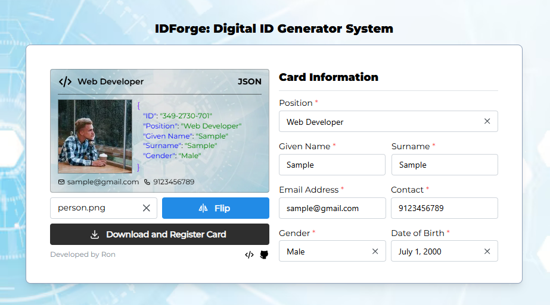

# IDForge: Digital ID Generator System



## 📋 Overview

IDForge is a modern web application that allows users to create, register, and print professional digital ID cards. Built with React, TypeScript, and modern UI frameworks, it provides an intuitive interface for generating standardized identification cards with customizable information and profile photos.

## ✨ Features

### 🆔 ID Card Generation

- **Professional Design**: Clean, JSON-themed ID card layout
- **Dual-sided Cards**: Front and back card views with flip animation
- **Real-time Preview**: Live preview of card as you input information
- **Standard Dimensions**: Cards sized to industry-standard ID card dimensions (3.375" × 2.125")

### 👤 User Information Management

- **Personal Details**: Name, position, email, contact number
- **Profile Photo Upload**: Support for PNG, JPEG, and JPG formats
- **Gender Selection**: Dropdown for gender specification
- **Birthdate Picker**: Calendar-based date selection
- **Auto-generated ID**: Unique identifier for each card

### 🖨️ Printing & Export

- **Direct Printing**: Browser-based printing with optimized print styles
- **Print Preview**: Accurate representation of final printed card
- **High-Quality Output**: Print-optimized CSS for crisp, professional results
- **Standard Paper Support**: Designed for standard printer paper sizes

### 💾 Data Management

- **Supabase Integration**: Secure cloud storage for user data
- **Profile Image Storage**: Automated image upload and URL generation
- **Form Validation**: Comprehensive input validation
- **Data Reset**: Easy form clearing after successful registration

### 🎨 User Experience

- **Responsive Design**: Works on desktop and mobile devices
- **Modern UI**: Built with Mantine components and Tailwind CSS
- **Confirmation Modals**: User-friendly confirmation dialogs
- **Loading States**: Visual feedback during operations
- **Error Handling**: Graceful error management with user notifications

## 🛠️ Tech Stack

### Frontend

- **React 18** - Modern React with hooks
- **TypeScript** - Type-safe development
- **Vite** - Fast build tool and dev server
- **Mantine** - React components library
- **Tailwind CSS** - Utility-first CSS framework
- **React Router** - Client-side routing

### Backend & Storage

- **Supabase** - Backend-as-a-Service
- **PostgreSQL** - Database (via Supabase)
- **Supabase Storage** - File storage for profile images

### Icons & Assets

- **Tabler Icons** - Beautiful SVG icons
- **Custom Background** - Branded background images

## 🚀 Getting Started

### Prerequisites

- Node.js (v16 or higher)
- npm or yarn package manager
- Supabase account (for backend services)

### Installation

1. **Clone the repository**

   ```bash
   git clone https://github.com/ronaldgulayan/IDForge
   cd IDForge
   ```

2. **Install dependencies**

   ```bash
   npm install
   ```

3. **Set up environment variables**
   Create a `.env` file in the root directory:

   ```env
   VITE_SUPABASE_URL=your_supabase_url
   VITE_SUPABASE_ANON_KEY=your_supabase_anon_key
   ```

4. **Start the development server**

   ```bash
   npm run dev
   ```

5. **Open your browser**
   Navigate to `http://localhost:5173`

## 📖 Usage Guide

### Creating an ID Card

1. **Fill in Personal Information**

   - Enter your position/job title
   - Input first name and last name
   - Select your birthdate
   - Provide email address
   - Choose gender from dropdown
   - Enter contact number

2. **Upload Profile Photo**

   - Click "Select your profile" button
   - Choose an image file (PNG, JPEG, or JPG)
   - Preview will appear on the card

3. **Preview Your Card**

   - Use the "Flip" button to see both sides
   - Verify all information is correct
   - Check that the photo displays properly

4. **Register and Print**
   - Click "Download and Register Card"
   - Confirm the action in the modal dialog
   - Your data will be saved to the database
   - Print dialog will automatically open
   - Choose your printer and print settings

### Print Settings Recommendations

- **Paper Size**: A4 or Letter
- **Orientation**: Portrait
- **Margins**: Minimum (0.25 inches)
- **Scale**: 100% (Do not fit to page)
- **Quality**: High/Best quality

## 🏗️ Project Structure

```
src/
├── components/           # Reusable UI components
├── pages/
│   ├── cards/           # Card-related components
│   │   ├── Front.tsx    # Front side of ID card
│   │   └── Back.tsx     # Back side of ID card
│   ├── styles/          # CSS files
│   │   └── card.css     # Card and print styles
│   ├── Card.tsx         # Main card container
│   └── Form.tsx         # Input form component
├── helpers/
│   └── methods.ts       # Utility functions
├── types/               # TypeScript type definitions
├── images/              # Static assets
└── supabase.ts          # Supabase configuration
```

## 🎨 Customization

### Styling

- **Card Design**: Modify `src/pages/cards/Front.tsx` and `Back.tsx`
- **Print Styles**: Edit `src/pages/styles/card.css`
- **Colors**: Update Tailwind classes or CSS variables
- **Layout**: Adjust component structure in main files

### Functionality

- **Form Fields**: Add/remove fields in `Form.tsx` and type definitions
- **Validation**: Modify validation rules in form handlers
- **Database Schema**: Update Supabase table structure as needed

## 🔧 Configuration

### Supabase Setup

1. **Create a new Supabase project**
2. **Set up the accounts table**:

   ```sql
   CREATE TABLE accounts (
     id SERIAL PRIMARY KEY,
     account_id VARCHAR UNIQUE NOT NULL,
     position VARCHAR,
     firstname VARCHAR NOT NULL,
     lastname VARCHAR NOT NULL,
     email VARCHAR NOT NULL,
     contact VARCHAR,
     gender VARCHAR,
     birthdate DATE,
     profile VARCHAR,
     created_at TIMESTAMP DEFAULT NOW()
   );
   ```

3. **Configure storage bucket** for profile images
4. **Set up Row Level Security (RLS)** policies as needed

## 🚀 Deployment

### Build for Production

```bash
npm run build
```

### Deploy to Netlify/Vercel

1. Connect your repository
2. Set environment variables
3. Deploy with build command: `npm run build`
4. Set publish directory: `dist`

## 🤝 Contributing

1. Fork the repository
2. Create a feature branch (`git checkout -b feature/amazing-feature`)
3. Commit your changes (`git commit -m 'Add amazing feature'`)
4. Push to the branch (`git push origin feature/amazing-feature`)
5. Open a Pull Request

## 📝 License

This project is licensed under the MIT License - see the [LICENSE](LICENSE) file for details.

## 👨‍💻 Developer

**Ron Gulayan**

- Portfolio: [ronaldgulayan.github.io/portfolio](https://ronaldgulayan.github.io/portfolio/)
- GitHub: [@ronaldgulayan](https://github.com/ronaldgulayan)
- Project Repository: [IDForge](https://github.com/ronaldgulayan/IDForge)

## 🙏 Acknowledgments

- [Mantine](https://mantine.dev/) for the excellent React components
- [Tailwind CSS](https://tailwindcss.com/) for utility-first styling
- [Tabler Icons](https://tabler-icons.io/) for beautiful icons
- [Supabase](https://supabase.com/) for backend services
- [Vite](https://vitejs.dev/) for fast development experience

---

**Made with ❤️ by Ron Gulayan**
